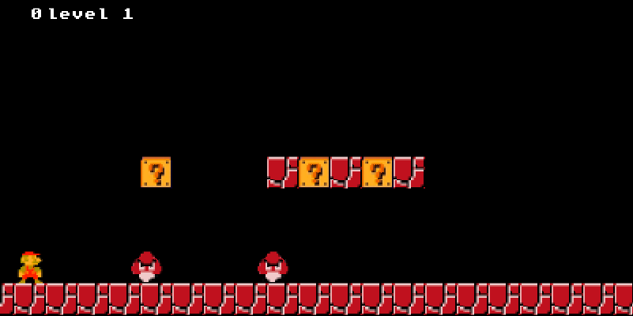
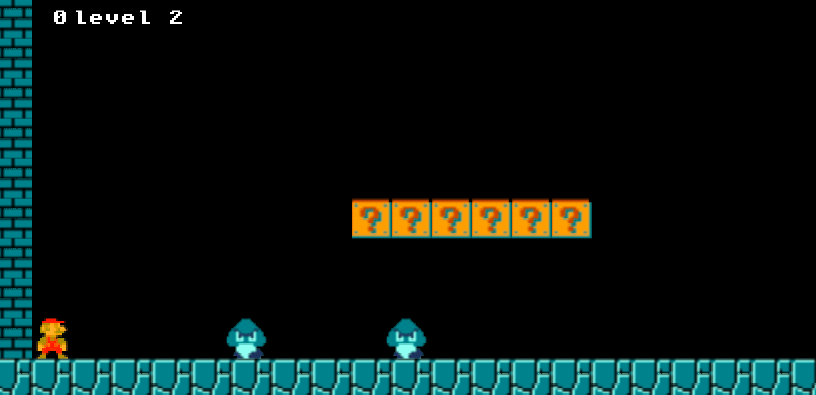

# SUPER MARIO
A sample of super mario game replica.
## Description


## Setup/Installation Requirements
* Fork/Clone the repository
```
   $ git clone https://github.com/andreassenmarvin/Super-mario.git
```
* Open your project on your favorite editor
* Open project on Live Server
* Use directions to move player
* Use space to jump
## Known Bugs
No known bugs
## Technologies Used
* HTML
* JavaScript
## Support and contact details
Incase of any contributions,query or issues,you can reach me through the email below:
machariamarvin625@gmail.com
### License
This project is licensed under the [MIT LICENSE](https://github.com/andreassenmarvin/Super-mario/blob/master/LICENSE) 
